# Inteli Blockchain no Inteli Day: Como Criamos uma Aplicação de NFTs com Solana para Engajar Alunos e Clubes

O Inteli Day é um dos eventos mais importantes do nosso calendário acadêmico do [Inteli](https://www.inteli.edu.br/). É o dia em que abrimos as portas para futuros alunos, apresentamos nossos cursos, projetos e as atividades dos clubes estudantis. Como membros do Inteli Blockchain, queríamos mais do que apenas apresentar slides; queríamos construir algo real e que resolvesse um problema real do evento.

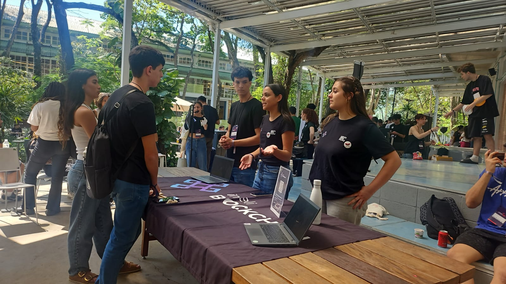

Quem já participou desse evento sabe como ele pode ser intenso. Com diversas palestras, ativações e stands, e durante a apresentação dos clubes muitos visitantes ficavam perdidos, sem saber qual clube visitar ou qual atividade seguir. Para alguns clubes, isso significava uma dificuldade em atrair visitantes e às vezes acontecia de faltarem brindes e recompensas para oferecer a quem participava de suas atividades.

Dessa forma, a pergunta que nos guiou foi: como poderíamos usar a tecnologia blockchain para criar uma experiência mais interativa, gamificada e que deixasse uma marca positiva tanto para os visitantes quanto para os clubes?

## A Solução: Uma Plataforma de Recompensas Digitais com NFTs

Nossa resposta foi construir uma solução completa para a emissão de NFTs. A ideia era simples: cada clube teria a capacidade de criar e distribuir NFTs exclusivos como "selos digitais" para os alunos que visitassem seu stand.

Isso transformaria a visitação em uma espécie de "caça ao tesouro", incentivando os alunos a explorarem os diferentes clubes para colecionar os ativos digitais. Para os clubes, seria uma forma de engajar o público e oferecer uma recompensa verificável e tecnológica. E para que isso funcionasse, a solução precisava atender a três requisitos principais:

1. Custos de Mint Baixos: Para viabilizar a distribuição em massa, precisávamos de uma solução muito barata.

2. Experiência de Usuário Simples: O processo deveria ser fácil tanto para o clube (emitir) quanto para o aluno (receber), sem a necessidade de conhecimentos técnicos aprofundados.

3. Observabilidade e Controle: Precisávamos de um backend para gerenciar tudo, com controle de chaves, idempotência e escalabilidade.

## Arquitetura Técnica da Solução

Para tirar o projeto do papel, desenhamos uma arquitetura, combinando o poder da blockchain Solana com a flexibilidade da AWS e a organização do NestJS.

- Backend: NestJS (REST), escolhido por sua arquitetura modular e uso de TypeScript, o que facilitou a organização dos módulos (clubs, nft, mint, solana, etc.).

- Blockchain: Solana, escolhida por suas taxas baixas e alta velocidade de transação. Utilizamos dois padrões principais da Metaplex:

    - MPL Core: Para criar as coleções "mãe" de cada clube, estabelecendo sua identidade on-chain.

    - Compressed NFTs (cNFTs) via Bubblegum: Usando Árvores Merkle, reduzimos drasticamente o custo de mint de cada NFT, tornando viável a emissão de milhares de certificados a um custo muito baixo.

- Armazenamento (AWS):

    - AWS S3: Dividimos o uso em dois buckets: um público, para armazenar as imagens e os metadados (JSON) dos NFTs, garantindo que qualquer carteira ou explorador pudesse renderizá-los instantaneamente. E um bucket privado e versionado para guardar as chaves privadas das autoridades dos clubes, devidamente cifradas.

    - DynamoDB: Utilizamos um design de tabela única com chaves primárias e secundárias (PK/SK e GSIs) para armazenar os perfis dos clubes, os templates dos NFTs e os logs de mint. O modelo "PAY_PER_REQUEST" garantiu que só pagaríamos pelo que usássemos, com escalabilidade garantida.

## Como a Solana Foi Utilizada
A escolha da Solana foi motivada por garantir que a solução tivesse um desempenho rápido e de baixo custo, e a forma como usamos seus recursos foi um dos grandes diferenciais, sendo esses:

1. Coleções com MPL Core:

Cada clube cadastrado na plataforma tinha sua própria coleção de NFTs criada on-chain usando o padrão MPL Core. Essa coleção funcionava como a identidade verificável do clube no mundo digital. A aplicação pagava pela criação da coleção, mas a autoridade de atualização era delegada à chave do clube, garantindo sua autonomia.

2. Mints em Massa com Compressed NFTs (cNFTs):

Este foi o ponto-chave para a viabilidade econômica. Em vez de mintar NFTs tradicionais, que exigem a criação de uma conta on-chain para cada um, usamos a compressão de estado (State Compression).

- Árvore Merkle Global: Para otimizar ainda mais, criamos uma única Árvore Merkle global para ser compartilhada por todos os clubes. Isso significa que o custo de "aluguel" (rent) para a criação da árvore foi pago apenas uma vez e amortizado entre todos os mints do evento. Um ponteiro no nosso banco de dados (APP#GLOBAL / COMPRESSION#ACTIVE) nos permitia trocar a árvore ativa caso a atual ficasse cheia, sem precisar alterar o código da aplicação.

- O Fluxo de Mint: Quando um aluno escaneava um QR Code no stand de um clube, nossa API recebia o endereço de sua carteira e disparava o mint de um cNFT. A transação era paga pela nossa tesouraria, o dono do NFT era o aluno e a autoridade lógica era o clube. O resultado? Um NFT entregue na carteira do aluno em segundos, a um custo de uma fração de centavo.

3. Idempotência e Segurança:

Para evitar mints duplicados ou fraudes, nosso sistema criava um registro no DynamoDB (CLUB#<id> / CMINT#<nftId>#<recipient>) antes de cada transação. Se uma tentativa de mint para o mesmo aluno e mesma missão ocorresse novamente, o sistema a bloqueava.

## Como Foi na Prática: A Jornada do Visitante no App

Toda essa arquitetura de backend e blockchain só faz sentido se a experiência na ponta for fluida e divertida. Por isso, criamos uma aplicação web simples e direta para guiar os visitantes. Abaixo podemos ver como foi a jornada do usuário, tela por tela.

### 1. O Ponto de Partida: Missões e Descoberta

Ao entrar na aplicação, o visitante caía na tela de **Missões**. Ali, ele tinha uma visão geral do seu progresso e qual era seu próximo desafio. Cada missão era um enigma ou uma dica que apontava para um clube específico, transformando a visitação em um jogo de exploração.

<table>
  <tr>
    <td>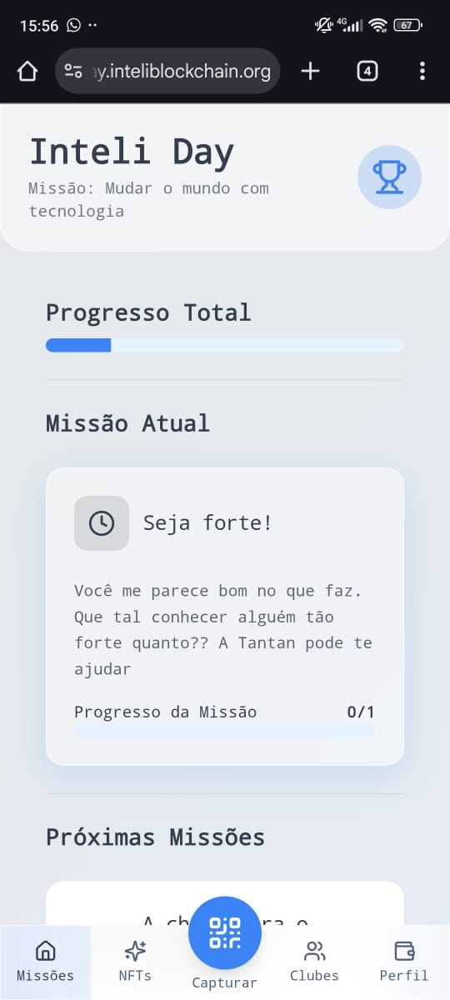</td>
    <td>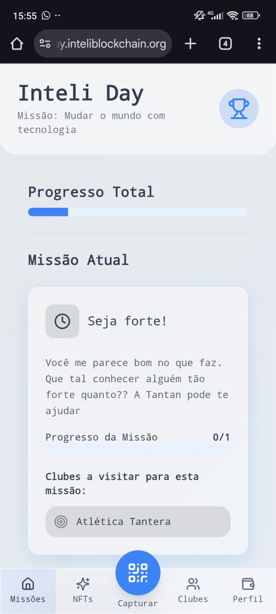</td>
  </tr>
</table>

 *Legenda: À esquerda, a tela inicial com o progresso total e a missão atual. À direita, o detalhe da missão, indicando qual clube visitar.*

O usuário também podia navegar pela aba **Clubes** para ver a lista de todos os participantes, ler sobre suas especialidades e conferir a "Collection Pubkey" de cada um, um link direto para a identidade on-chain do clube.

<table>
  <tr>
    <td>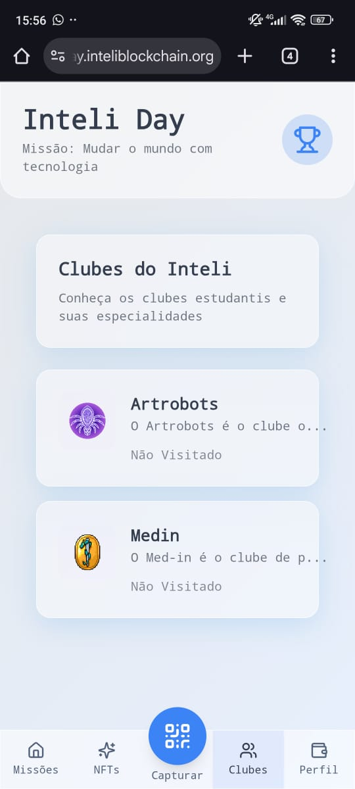</td>
    <td>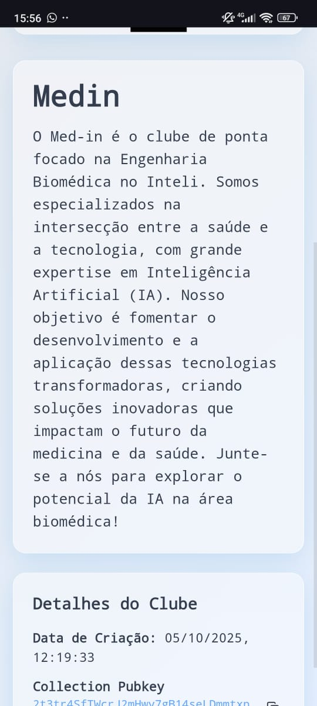</td>
  </tr>
</table>

*Legenda: Lista de clubes participantes e o detalhe de um clube, com sua descrição e a public key da coleção na Solana.*

#### 2. A Hora da Verdade: Capturando o NFT

Quando o visitante chegava ao stand do clube correto, a mágica acontecia. Ele abria a aba **Capturar**, que exibia um QR Code único associado à sua carteira Solana. O representante do clube escaneava esse código com um dispositivo da organização, e nossa API fazia o resto: validava a missão e disparava o mint do cNFT direto para a carteira do aluno.

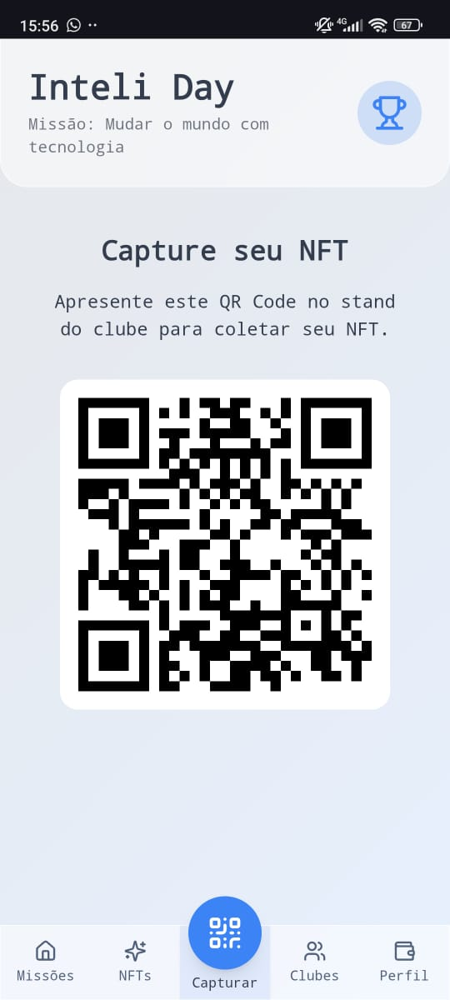

*Legenda: A tela de captura, onde o aluno apresentava seu QR Code para o clube realizar o mint do NFT.*

#### 3. A Sala de Troféus: Sua Coleção On-Chain

Missão cumprida! O NFT recém-adquirido aparecia instantaneamente na aba **NFTs**, a galeria pessoal do visitante. Era a prova digital da sua jornada, mostrando todos os "selos" que ele havia coletado.

<table>
  <tr>
    <td>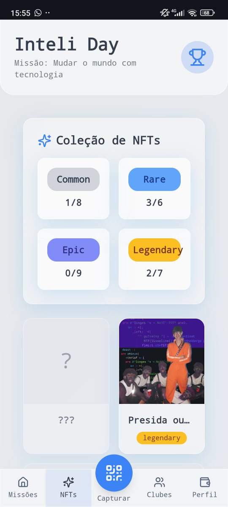</td>
    <td>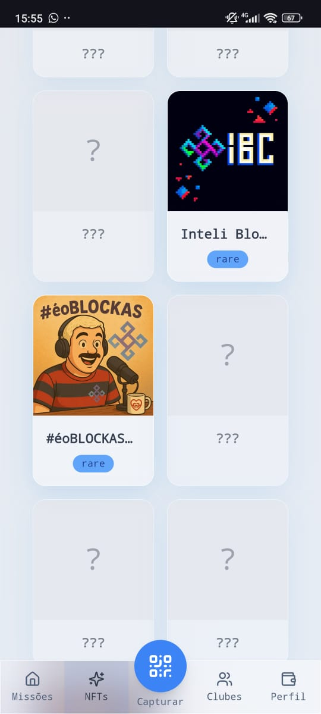</td>
  </tr>
</table>

*Legenda: A galeria de NFTs do usuário, exibindo os colecionáveis já adquiridos e os espaços para os que ainda faltavam.*

O mais legal é que cada NFT era inspecionável. Ao clicar em um deles, o usuário via todos os detalhes técnicos, incluindo o link para o metadata no S3 e, o mais importante, os **Dados da Blockchain**: a assinatura da transação e o Asset ID. Essa era a prova dos nove, a garantia de que aquele ativo digital era verificável, único e verdadeiramente seu.

<table>
  <tr>
    <td>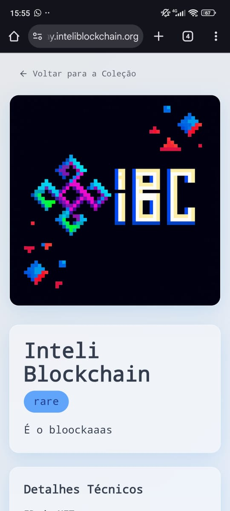</td>
    <td>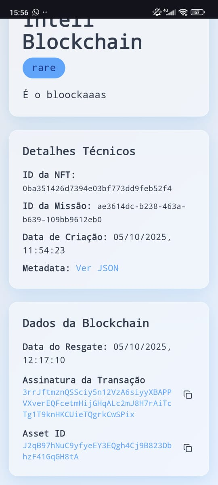</td>
  </tr>
</table>

*Legenda: Detalhes de um NFT, mostrando sua arte, raridade e os dados on-chain que comprovam sua autenticidade e posse.*

#### 4. Acompanhando o Progresso: O Perfil do Caçador

Por fim, na aba **Perfil**, o usuário tinha um resumo completo de seu desempenho: quantos NFTs havia coletado, a porcentagem de missões concluídas e quantos clubes tinha visitado. Era o dashboard perfeito para alimentar o espírito de colecionador e incentivar a galera a completar todo o circuito.

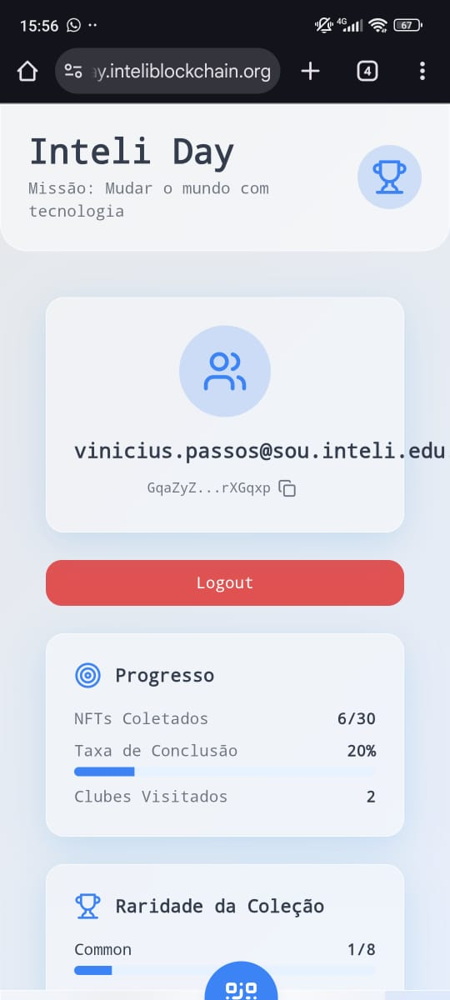

*Legenda: A tela de perfil, com as estatísticas de progresso do usuário no evento.*

Essa interface simples, conectada diretamente à nossa poderosa API, foi a chave para transformar um conceito técnico complexo em uma experiência de usuário divertida e recompensadora.

Perfeito! Agora vamos mergulhar nos bastidores e mostrar como os clubes gerenciaram tudo isso. A experiência do organizador tinha que ser tão boa quanto a do participante.

Aqui está a sugestão para a seção sobre o aplicativo dos clubes. Você pode inseri-la logo após a seção "Como Foi na Prática: A Jornada do Visitante no App".

## Nos Bastidores: A Jornada dos Clubes no App

Para que a experiência dos clubes fosse completa, a ferramenta dos deles precisava ser intuitiva e à prova de falhas. Afinal, eles estariam na linha de frente, interagindo com os alunos no meio do evento. Por isso, criamos um app de controle exclusivo para eles, conforme está nas imagens abaixo.

### 1. O Centro de Comando: Dashboard de NFTs

Ao logar, o membro do clube acessava um dashboard com todos os "templates" de NFT que eles haviam criado. Dessa forma, buscamos criar uma tela organizada de todas as recompensas digitais disponíveis para distribuição, cada uma associada a uma missão ou atividade específica.

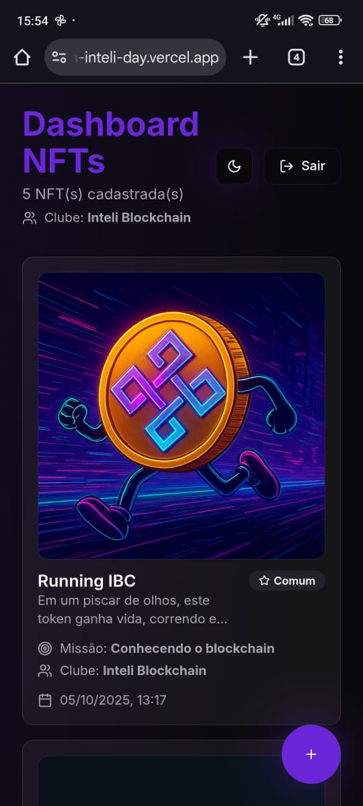

*Legenda: O dashboard principal do clube, listando os NFTs já criados e prontos para serem distribuídos.*

### 2. Criando a Recompensa em Minutos

A qualquer momento, o clube podia criar um novo NFT. Clicando no botão "+", eles abriam um formulário simples para fazer o upload da arte, definir o título, a descrição e a raridade. Nos bastidores, essa ação disparava nossa API, que subia a imagem para o S3, criava o arquivo de metadados JSON e salvava o template no DynamoDB, já gerando o `nftId` determinístico.

<table>
  <tr>
    <td>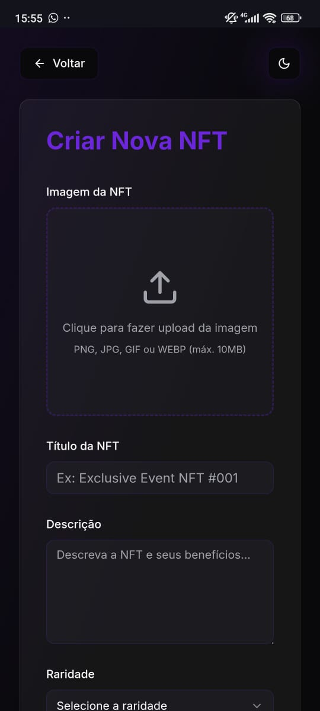</td>
    <td>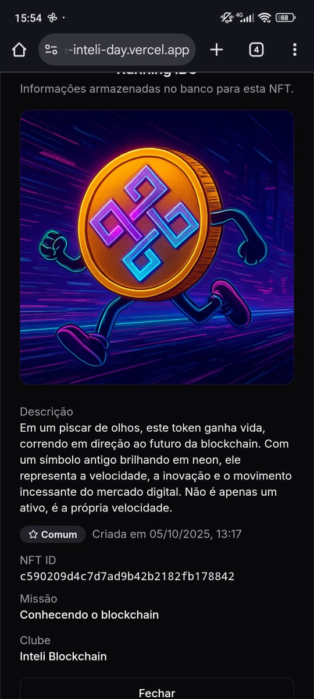</td>
  </tr>
</table>

*Legenda: À esquerda, o formulário de criação do template do NFT. À direita, o detalhe de um template já salvo no banco de dados.*

### 3. A Entrega do Prêmio: Mint em Dois Cliques

Essa era a tela mais usada durante o evento. Quando um aluno cumpria uma missão, o membro do clube abria a funcionalidade de envio. O processo era direto:

1.  **Selecionar o NFT:** Escolher em uma lista qual recompensa seria entregue.
2.  **Informar a Carteira:** Abrir a câmera para escanear o QR Code do aluno (que já continha o endereço da carteira) ou, como plano B, colar o endereço manualmente.

Com um clique em "Confirmar", a requisição era enviada para o nosso backend, que executava todo o fluxo de mint do cNFT na Solana.

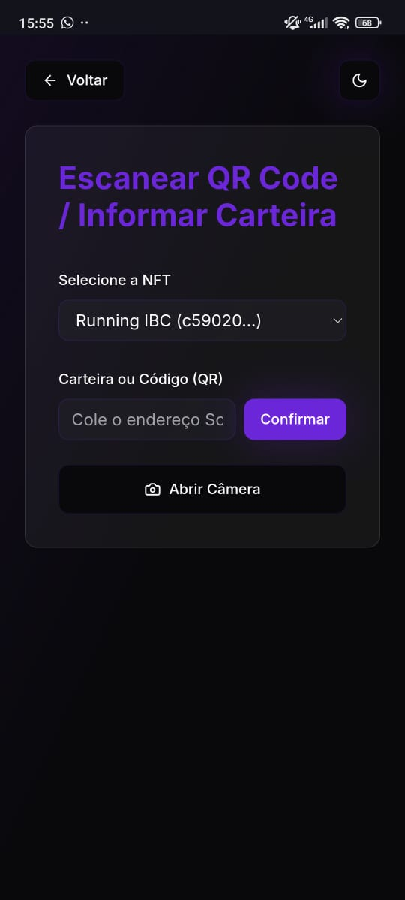

*Legenda: A tela de mint, onde o clube selecionava o NFT e escaneava o QR Code do aluno para enviar a recompensa.*

### 4. Tudo Registrado: Histórico de Transações

Para garantir total transparência e controle, cada clube tinha acesso a um histórico completo de todas as transações realizadas. Era possível ver a data, qual NFT foi enviado e para qual carteira, com a opção de filtrar as buscas. Essa tela lia diretamente os logs de mint que persistimos no DynamoDB, dando ao clube uma visão clara do impacto de suas atividades.

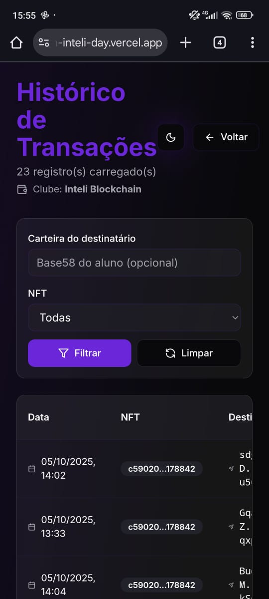

*Legenda: O histórico de transações, permitindo ao clube auditar todas as distribuições de NFTs feitas.*

Com essa ferramenta, os clubes ganharam total autonomia para gerenciar suas recompensas digitais, desde a criação até a distribuição e o acompanhamento, tudo isso sem precisar interagir com a complexidade da blockchain diretamente.

## Os Resultados

Depois de uma maratona de 1 semana de desenvolvimento, a prova de fogo foi o Inteli Day. A grande questão era: a galera iria aderir? Os clubes iriam usar a ferramenta? A infraestrutura aguentaria o grande volume de requisições?

A resposta está nos dashboards que montamos para acompanhar o evento em tempo real. E sim, foi um sucesso.

### O Engajamento dos Clubes e o Ritmo do Evento

O primeiro indicador que acompanhamos foi o ranking de mints por clube. Ficou claro que a competição foi acirrada! O Inteli Blockchain e a Comunidade Wave lideraram a disputa pelo topo, mostrando um engajamento incrível e distribuindo dezenas de NFTs. No total, 8 clubes participaram ativamente, provando que a ferramenta foi bem adotada.

Ao mesmo tempo, o gráfico de fluxo de mints por minuto nos mostrava o "pulso" do evento. Vimos os picos de atividade, em momentos de maior movimento nos stands, com a nossa infraestrutura aguentando tranquilamente alcançando picos de até 4 mints por minuto sem atrasos.

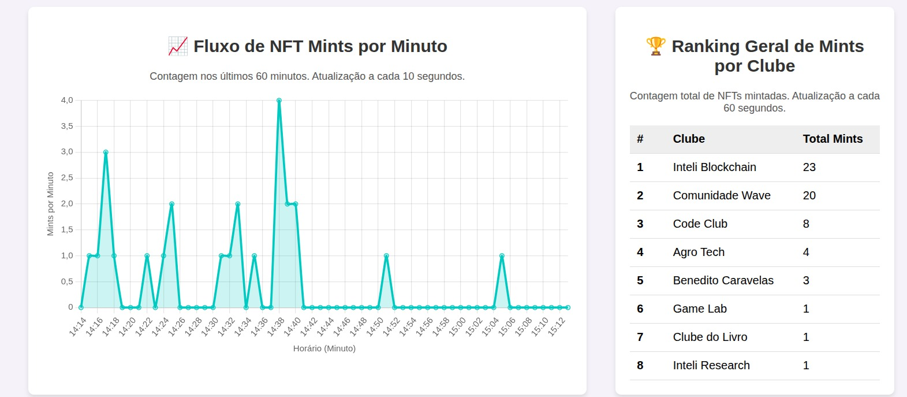

*Legenda: À esquerda, o fluxo de mints durante o evento, mostrando os picos de engajamento. À direita, o ranking final de mints por clube.*

### Os NFTs Mais Cobiçados

Mas quais foram as recompensas que a galera mais curtiu? O ranking de NFTs mais mintados nos deu essa resposta. Vimos que o NFT "Presida ou Vector" da Comunidade Wave foi o grande campeão, com 9 mints. Essa visão detalhada nos permitiu entender não apenas *quantos* NFTs foram distribuídos, mas *quais* foram os mais desejados, gerando dados que poderão ser usados para os próximos eventos.

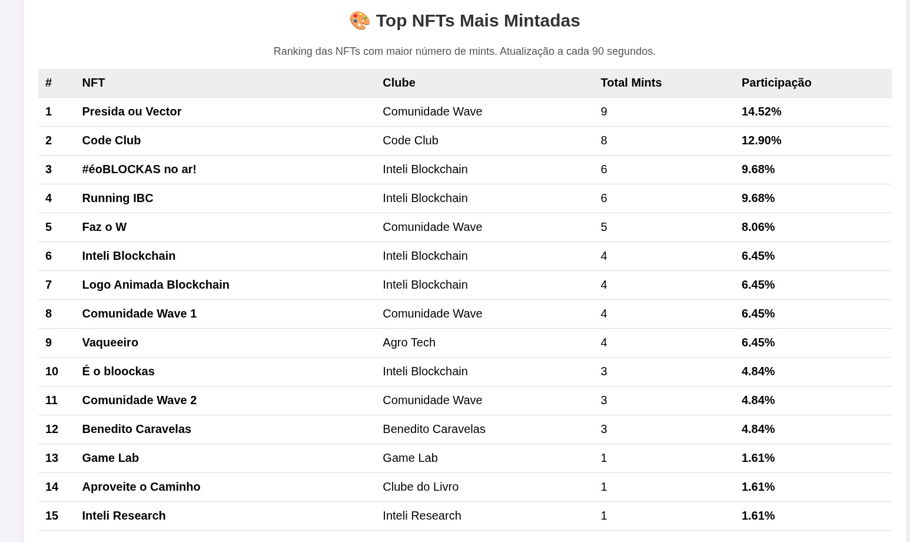

*Legenda: O ranking detalhado dos 15 NFTs mais mintados durante o Inteli Day.*

## Conclusão

O projeto do Inteli Day foi muito mais do que um exercício técnico; foi a prova de que a tecnologia blockchain, quando aplicada para resolver um problema real, pode criar experiências incríveis. Saímos de um cenário onde visitantes estavam perdidos, para um ambiente gamificado, interativo e com recompensas digitais verificáveis.

A escolha do stack se provou acertada: a Solana, com seus Compressed NFTs, nos deu a escala e o custo-benefício necessários; a AWS garantiu uma infraestrutura robusta e escalável; e o NestJS manteve nosso código organizado e manutenível.

Ver os gráficos subindo em tempo real e os alunos mostrando suas coleções de NFTs foi a maior recompensa. Esperamos que este projeto inspire outros a tirarem suas ideias do papel e a usarem a tecnologia para construir soluções práticas e divertidas. Nos vemos no próximo evento!

## Repositórios do Projeto

Ficou curioso para ver o código? Todo o projeto é open source! Dê uma olhada nos nossos repositórios no GitHub e sinta-se à vontade para contribuir ou tirar dúvidas:

1. Frontend: 

    - [Aplicação do Usuário](https://github.com/VinTesta/inteli-quest-nft) 

    - [Aplicação dos Clubes](https://github.com/VinTesta/mint-booth-pro)

2. Backend:
   -  [API em NestJS com Solana e AWS](https://github.com/VinTesta/inteli-day-api)

> Uma contribuição de [Giovanna Britto](https://github.com/giovanna-britto) e [Vinicius Testa](https://github.com/VinTesta) 

