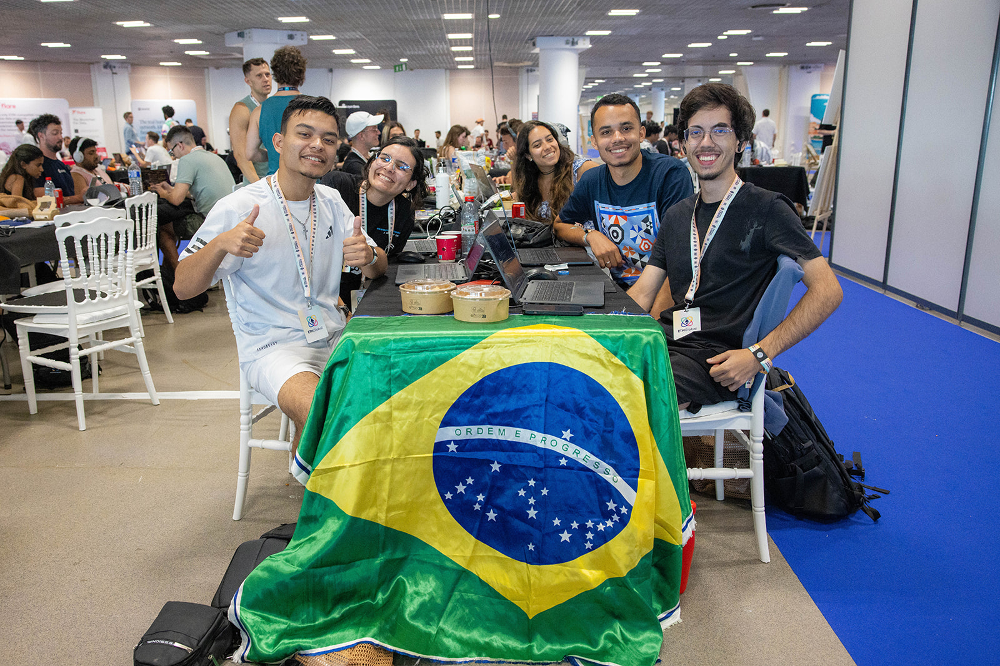

# Tendências da Web3 em 2025

**Opa galera, e aí!**  
Aqui é o *CryptoVictor* e hoje vamos conversar sobre o que eu vejo como as principais tendências que a Web3 está seguindo em 2025. Falo isso baseado no que vi da comunidade mesmo ao longo deste ano — e isso inclui diferentes esferas da Web3: a EVM, Solana, tecnologias como Chainlink, e até a galera da esfera bitcoiner.

Tive o privilégio de participar de vários eventos gigantes de cripto em 2025, como **ETHGlobal Cannes**, **Chiliz Paris**, **Casa21**, **MetaMask Builders Night**, **Modular Carnival**, **Vega House**, entre muitos outros — e em todos eles percebi que a comunidade está bem focada em alguns pontos bem específicos.

---

## IA em Web3

O primeiro ponto — e talvez o mais falado — é sobre **IA**, a tecnologia do momento. Vejo que *IA na Web3* é o assunto mais discutido hoje em dia. Startups pipocam a cada canto, principalmente agora com a explosão dos **Agentes Autônomos** (tipo AutoGPTs descentralizados, conectando dApps, carteiras e oráculos de forma automatizada).

E essa é, na real, uma das tecnologias que mais **faz sentido junto da Web3**: dados são a base da IA, e Web3 tem como princípio a soberania sobre os próprios dados. Sem falar da questão da identidade digital e da privacidade, que voltaram com tudo.

Tive conversas bem massa com nomes grandes de IA no ETHCannes, e muitos deles citaram o potencial de projetos como a **Worldcoin** (polêmico e esquisito, mas com uma proposta bem interessante), que já dá uma amostra do uso prático de identidade global integrada com IA e blockchain.

---

## RWAs e Oráculos

Agora, saindo um pouco das tecnologias hypadas, bora falar de um **"cavalo velho"** da Web3 que continua firme: os **RWAs (Real World Assets)**.

RWAs basicamente são ativos do mundo real tokenizados na blockchain — e isso inclui imóveis, ações, títulos, commodities, entre outros. Muita gente fala que esse pode ser o **maior caso de uso da economia descentralizada**.

Só que… ainda não rolou o boom. A **questão regulatória** continua sendo o grande gargalo. Nenhum projeto realmente escalou globalmente ainda — embora no Brasil a gente já veja algumas iniciativas legais, nada concreto realmente foi feito.

Um ponto importante é que nesta tecnologia o papel dos **oráculos**, principalmente a **Chainlink**, é essencial aqui. É ela quem conecta dados reais a blockchain de forma segura e ver os recentes lançamentos dela como o **CCIP (Cross-Chain Interoperability Protocol)**, animou bastante quem vê os RWAs como o futuro.

---

## Criptografia e Privacidade

Você pode estar se perguntando: *“Ué, privacidade e criptografia como tendência? Isso já não é uma das bases da Web3, CryptoVictor?”*

E eu te digo: **sim, é base**, mas estamos entrando numa nova fase disso.  
Não é só **ZK (Zero-Knowledge)** — que, aliás, continua evoluindo com força —, mas também **soluções novas em L2**, **abstração de contas (Account Abstraction)**, e a galera já preocupada com **criptografia pós-quântica**, mesmo sem um problema imediato.

A quantidade de soluções de privacidade que surgiram em 2024 e agora em 2025 é absurda. Protocolos como **Railgun**, **Aztec**, e as melhorias nas **bridges** mostram como o ecossistema está finalmente conseguindo equilibrar segurança e usabilidade.

Até mesmo os bitcoiners, que historicamente eram contra mudanças na base do protocolo, estão explorando novos recursos via **Ordinals**, **Covenants** e **BitVM**.

---

## Uma nota sobre maturidade

Hoje a Web3 parece mais madura. Já não vemos tantos projetos lançando tokens só por lançar, nem promessas milagrosas de 1000x em uma semana (apesar de isso ainda existir e sempre existir). A diferença é que **as soluções reais estão se sobressaindo**.

Dá pra perceber isso até na linguagem dos investidores e builders nos eventos: é tudo mais técnico, mais pé no chão, mais sério.

---

## Conclusão

A real é que a Web3 **não para**. E pra mim, o *boom* desse universo está só começando.  
Sim, o mercado está mais cauteloso, mas também **mais preparado**. As barreiras regulatórias estão caindo aos poucos, e cada vez mais vemos soluções reais e com impacto direto nas pessoas.

Sem falar na própria **alta do Bitcoin** recente, que trouxe de volta os olhares do mercado tradicional. Mas dessa vez, com mais estrutura, mais casos de uso, e uma comunidade global ainda mais forte.

Seguimos construindo, aprendendo e acelerando.
A Web3 tá só começando a mostrar do que é capaz.
É só o começo da próxima revolução digital — e o topo já tá logo ali. 🚀

*CryptoVictor, out.*

