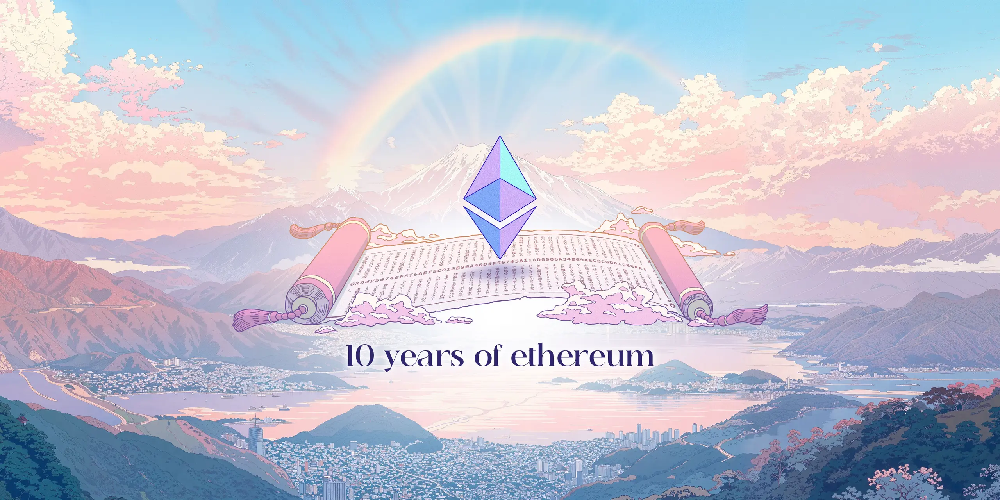
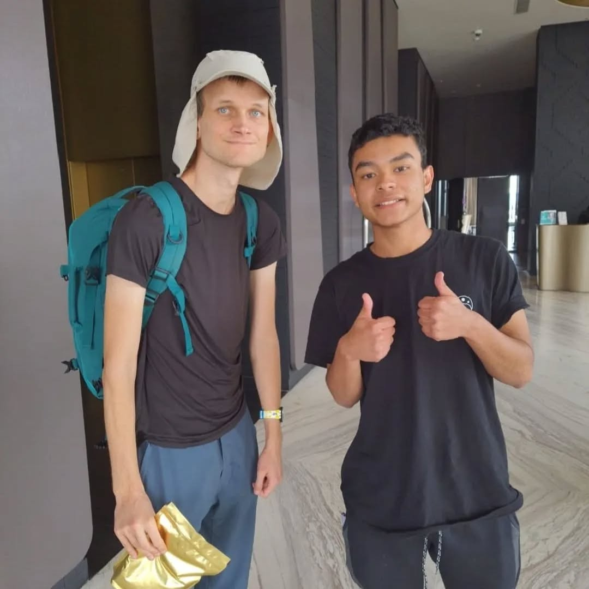

# Believe in Som**ΞTH**ing

**Fala pessoal, tudo certo?**  
*CryptoVictor* aqui, e hoje o papo é especial demais: o **Ethereum completa 10 anos** neste 30 de julho de 2025.  
E não é só o aniversário de uma blockchain — é um momento histórico pra toda uma comunidade global.

---

---

## De rede a movimento global

Quando o Ethereum nasceu, lá em 2015, **nada do que temos hoje existia**. Termos como *Web3*, *Layer 2*, *DAOs*, *dApps* e *smart contracts* simplesmente **não faziam parte do vocabulário**.

Hoje, essas palavras moldam um novo mundo digital.  
O Ethereum não foi só uma nova blockchain — ele foi o **berço de um ecossistema** inteiro que continua crescendo a cada fork, upgrade, e comunidade criada.

---

## Uma rede que respira

Algo importante a se lembrar é como o Ethereum evoluiu **absurdamente** nesses 10 anos:

- Superou o **DAO Attack** e se reinventou com o hard fork.
- Mudou sua base com o **The Merge**, saindo do *Proof of Work* para o *Proof of Stake*.
- Incentivou a criação de **Layer 2s** como Optimism, Arbitrum, Base e zkSync.
- Ajudou a consolidar uma cultura própria com os **ETHGlobals**, hackathons, eventos e devs no mundo todo.

Tudo isso mostra que o Ethereum **não é só código. É comunidade viva**. É o Infinite Garden crescendo.

---

## A blockchain do mundo

É verdade que não sabemos o que o futuro reserva.  
Talvez a Solana escale ainda mais. Talvez a Cardano entregue tudo o que prometeu.  

Mas também é verdade que o Ethereum **nunca caiu**.  
Ele resistiu a ataques, críticas, falhas e promessas de blockchains “melhores”.  
Hoje, ele segue firme como **a blockchain do mundo** — viva, resiliente e em constante evolução.

---

## O começo

Parece piada, mas tudo começou com um jogo.  
**Vitalik Buterin**, ainda adolescente, jogava *World of Warcraft* e ficou inconformado com a centralização.  
Anos depois, ele criou o Ethereum — e o resto é história.

Pra mim, isso não é só inspirador. É **transformador**, como algo tão simples para alguns, o motivou a fazer algo tão grande.

---

## Minha homenagem como builder

Essa é a minha homenagem, como *CryptoVictor* e membro do **Inteli Blockchain**, pra rede que **mudou minha vida**.

O Ethereum não foi só uma tecnologia. Foi **o começo de um novo mundo** pra mim — onde pude criar, participar de hackathons, viajar, aprender, conhecer pessoas incríveis e sonhar mais alto.

---

## 🎂 Feliz aniversário, Ethereum!

Obrigado Ethereum.  
Obrigado Ethereum Foundation.  

De “irmã mais nova do Bitcoin” ao **ponto de partida de uma revolução digital**, o Ethereum está só começando.

> **Believe in somΞTHing.**  
> Porque acreditar em algo muda tudo.

---

*CryptoVictor, out.*  

