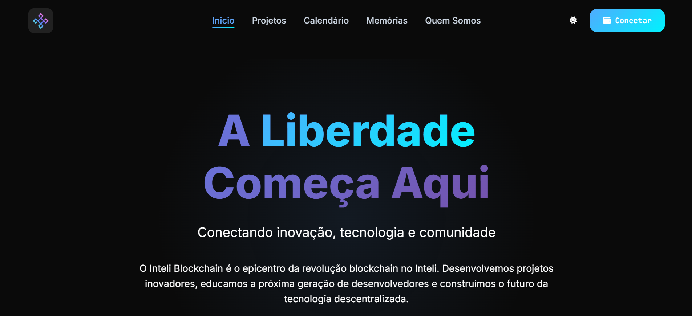
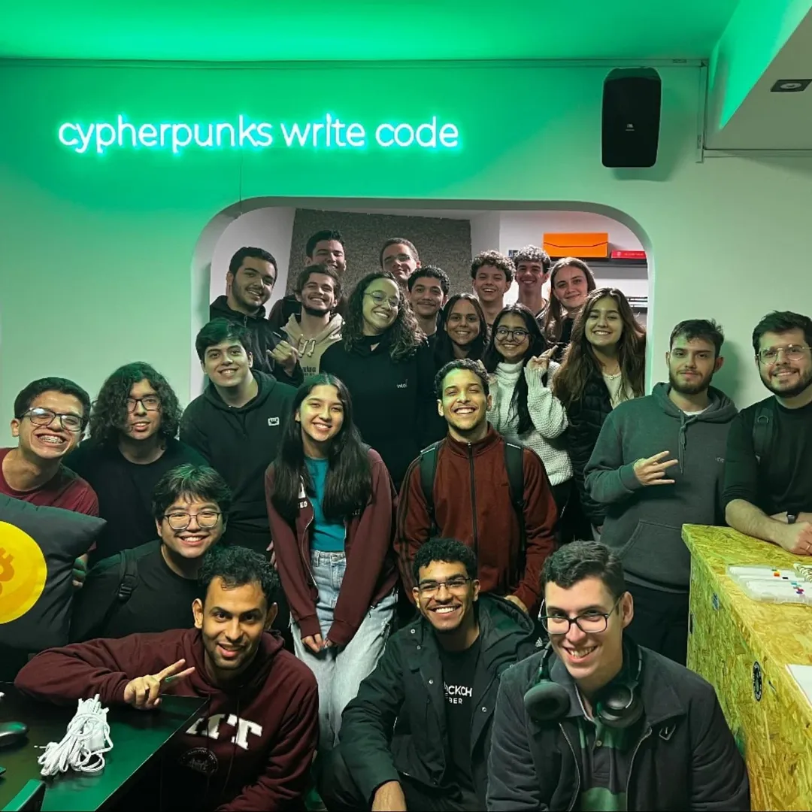

Salve, comunidade! Aqui é o CryptoVictor e é oficial: o Inteli Blockchain agora tem um site próprio! Eu sei, à primeira vista isso pode parecer só mais um projeto de faculdade, mas a real é que isso representa muito mais. É um marco ver como o clube tem evoluído. Temos um blog, um site, realizamos inúmeros eventos — e tem muito mais vindo por aí... A comunidade nunca esteve tão viva.

Como membro, não tenho como não comemorar. Ver até onde chegamos é uma vitória. E o mais empolgante: isso é só o começo. Vêm aí muitos outros projetos incríveis — e mal posso esperar para compartilhar cada um deles com vocês.

O Inteli Blockchain pode até ter nascido como um clube de hackathon dentro do Inteli, mas hoje é muito mais do que isso. É realmente uma comunidade, sabe?

Lembro bem da minha fase lá em 2021, no quarto, sozinho, curioso, estudando Web3 e blockchain, sonhando com o dia em que eu pudesse viver tudo isso com outras pessoas que compartilhassem a mesma paixão. E hoje, isso é real.

Este post é mais do que um anúncio do site. É também um agradecimento.  
Obrigado, Inteli. Obrigado a cada pessoa do Inteli Blockchain que vive, aprende, erra e cresce junto nesse universo.  
A gente fala sobre liberdade, tecnologia, futuro — e isso muda a vida de cada membro, inclusive a minha.

Então é isso. Um sincero obrigado a todos — e não deixem de conferir o site [[**LINK DO SITE AQUI**](https://www.inteliblockchain.org/)]. Tá ficando bem legal mesmo.

> A gente se vê no próximo bloco.

---

*CryptoVictor, out.*  

